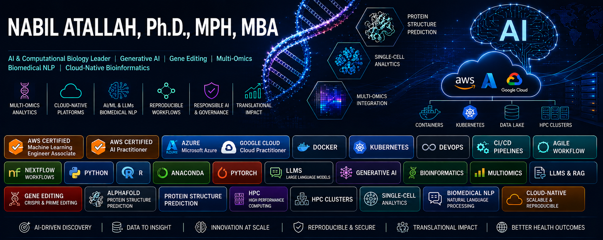

  

#### Flagship Project
**AI-Guided Prediction of Recombinase Specificity and Off-Target Genome Integration**

Computational frameworks for predicting recombinase specificity, off-target genome integration, and programmable genome engineering outcomes using AI/ML, sequence-function modeling, protein language models, and large-scale genomics analytics focused on:

- Predicting recombinase specificity and integration fidelity
- Modeling off-target genome integration risks
- Sequence-function and structure-function analysis
- AI-guided protein engineering workflows
- NGS analytics for genome editing validation
- Long-read and hybrid capture integration analysis
- Cloud-native scalable genomics pipelines
- Explainable AI for genome engineering systems

---
## Selected Projects

### AI-Guided Prediction of Recombinase Specificity and Off-Target Genome Integration

AI-driven framework for programmable genome engineering and translational therapeutics.

**Focus Areas**
- Recombinase specificity prediction
- Off-target genome integration modeling
- Protein language models
- NGS integration analytics
- Explainable AI for genome editing

**Core Stack**
`Python` `PyTorch` `LLMs` `Biopython` `AWS` `Nextflow`

---

### Interpretable AI Framework for Synergistic Drug Combination Discovery

Machine learning platform for predicting synergistic cancer drug combinations using pharmacogenomics and pathway-aware analytics.

**Focus Areas**
- Drug synergy prediction
- Pharmacogenomics integration
- Explainable AI (SHAP)
- Translational oncology analytics
- Computational drug discovery

**Core Stack**
`XGBoost` `Deep Learning` `SHAP` `DrugComb` `GDSC` `LINCS`

---

### Epigenetic Clock & Biological Aging Analytics Platform

Scalable methylation-based machine learning pipeline for biological age prediction and biomarker discovery.

**Focus Areas**
- DNA methylation analytics
- Aging biomarker discovery
- Explainable ML
- Multi-omics integration
- Translational aging research

**Core Stack**
`Python` `XGBoost` `ElasticNet` `Dask` `SHAP` `AnnData`

---

### Digital Twin Platform for Liver Disease Progression & Therapeutic Simulation

Cloud-native Digital Twin framework for predictive modeling of liver disease progression and therapeutic response.

**Focus Areas**
- Multi-omics integration
- Predictive disease modeling
- Clinical simulation analytics
- Precision therapeutics
- Real-time cloud analytics

**Core Stack**
`Python` `R` `AWS` `Systems Biology` `Clinical Data Analytics`

---

### CRISPR Prime Editing & Multi-Omics Validation Framework

Computational genome engineering workflows supporting prime editing optimization and multi-omics validation.

**Focus Areas**
- pegRNA optimization
- Off-target analysis
- Single-cell transcriptomics
- Functional pathway enrichment
- Precision therapeutics

**Core Stack**
`CRISPResso` `Seurat` `Scanpy` `MaxQuant` `KEGG` `GO`

---

### End-to-End Single-Cell RNA-Seq Analytics for Oncogenomics & Immunomics

Scalable single-cell workflows for tumor microenvironment analysis and translational immunotherapy research.

**Focus Areas**
- Tumor microenvironment profiling
- Immune cell characterization
- Pathway enrichment
- Precision oncology
- Reproducible scRNA-seq workflows

**Core Stack**
`Seurat` `Scanpy` `clusterProfiler` `ReactomePA`

---

### Integrated Proteo-Transcriptomics Analytics Platform

Multi-omics integration framework for biomarker discovery and systems biology analytics.

**Focus Areas**
- Proteo-transcriptomics integration
- Disease biomarker discovery
- Regulatory network analysis
- Systems biology
- Translational medicine

**Core Stack**
`R` `limma` `PCAtools` `ComplexHeatmap` `NormalyzerDE`

---

### Cloud-Native Epigenomics & Chromatin Biomarker Discovery Pipeline

Automated ChIP-seq and epigenomics workflows for chromatin biomarker discovery and regulatory analytics.

**Focus Areas**
- ChIP-seq automation
- Chromatin state analysis
- Histone modification profiling
- Regulatory genomics
- Translational oncology

**Core Stack**
`Nextflow` `Snakemake` `MACS2` `DiffBind` `Python` `R`

---

### Automated RNA-Seq & Disease Transcriptomics Pipeline

Reproducible RNA-seq workflows for disease-linked transcriptomics and biomarker prioritization.

**Focus Areas**
- Differential expression analysis
- Gene-disease association modeling
- Functional enrichment
- Precision medicine analytics
- Scalable transcriptomics workflows

**Core Stack**
`Nextflow` `DESeq2` `limma` `clusterProfiler` `Python`

---

### Biomedical NLP & Large Language Model (LLM) Analytics Platform

LLM-driven biomedical analytics platform for literature intelligence, omics annotation, and translational research support.

**Focus Areas**
- Biomedical NLP
- Scientific literature mining
- Omics annotation
- Clinical text analytics
- AI-assisted translational research

**Core Stack**
`BioBERT` `SciBERT` `BioGPT` `Transformers` `PyTorch`

---

### Clinical & Biomedical Text Mining Infrastructure

Scalable biomedical text mining system for knowledge extraction, clinical analytics, and precision medicine applications.

**Focus Areas**
- PubMed mining
- Biomedical entity recognition
- Clinical relationship extraction
- Drug discovery analytics
- Knowledge graph generation

**Core Stack**
`SciSpacy` `BioWordVec` `Flask` `Streamlit` `Docker` `AWS`

---

**Core Technologies**
`Python` `PyTorch` `JAX` `Biopython` `Nextflow` `Docker` `AWS` `LLMs` `Protein Language Models` `NGS Analytics`

---
## Teaching & Mentorship

Faculty experience in bioinformatics, computational biology, multi-omics analytics, biostatistics, reproducible research, and healthcare AI.

I mentor interdisciplinary teams across AI/ML, computational biology, biomedical data science, workflow automation, and scalable research computing.

---
## Contact

- LinkedIn: https://www.linkedin.com/in/nabilatallah/
- Email: nabilatallah@hotmail.com
