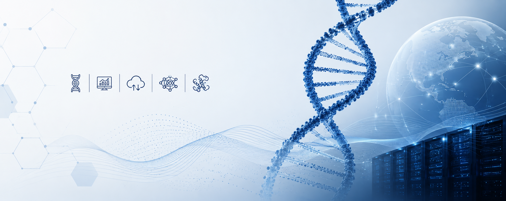

  

# Nabil Atallah, Ph.D., MPH, MBA

## AI & Computational Biology Leader | Generative AI | Gene Editing | Multi-Omics | Biomedical NLP | Cloud-Native Bioinformatics

Building AI-driven, cloud-native, and reproducible computational platforms for biomedical research, translational medicine, precision health, genome engineering, and multi-omics discovery.

---

# Flagship Project

## AI-Guided Prediction of Recombinase Specificity and Off-Target Genome Integration

AI-driven computational framework for programmable genome engineering and translational therapeutics.

### Focus Areas
- Recombinase specificity prediction
- Off-target genome integration modeling
- Protein language models
- AI-guided protein engineering
- NGS integration analytics
- Explainable AI for genome editing

### Core Stack
`Python` `PyTorch` `LLMs` `Biopython` `AWS` `Nextflow`

---

# Selected Projects

## Interpretable AI Framework for Synergistic Drug Combination Discovery

Machine learning platform for predicting synergistic cancer drug combinations using pharmacogenomics and pathway-aware analytics.

**Focus**
Drug synergy • Explainable AI • Translational oncology • Computational drug discovery

**Core Stack**
`XGBoost` `Deep Learning` `SHAP` `DrugComb` `GDSC`

---

## Epigenetic Clock & Biological Aging Analytics Platform

Scalable methylation-based machine learning pipeline for biological age prediction and biomarker discovery.

**Focus**
DNA methylation • Aging biomarkers • Explainable ML • Multi-omics integration

**Core Stack**
`Python` `XGBoost` `ElasticNet` `Dask` `SHAP`

---

## Digital Twin Platform for Liver Disease Progression & Therapeutic Simulation

Cloud-native Digital Twin framework for predictive modeling of liver disease progression and therapeutic response.

**Focus**
Multi-omics integration • Predictive modeling • Precision therapeutics • Clinical simulation

**Core Stack**
`Python` `R` `AWS` `Systems Biology`

---

## CRISPR Prime Editing & Multi-Omics Validation Framework

Computational genome engineering workflows supporting prime editing optimization and multi-omics validation.

**Focus**
pegRNA optimization • Off-target analysis • Single-cell transcriptomics • Precision therapeutics

**Core Stack**
`CRISPResso` `Seurat` `Scanpy` `KEGG` `GO`

---

## End-to-End Single-Cell RNA-Seq Analytics for Oncogenomics & Immunomics

Scalable single-cell workflows for tumor microenvironment analysis and translational immunotherapy research.

**Focus**
Tumor profiling • Immune analytics • Precision oncology • scRNA-seq workflows

**Core Stack**
`Seurat` `Scanpy` `clusterProfiler` `ReactomePA`

---

## Integrated Proteo-Transcriptomics Analytics Platform

Multi-omics integration framework for biomarker discovery and systems biology analytics.

**Focus**
Proteomics • Transcriptomics • Biomarker discovery • Regulatory network analysis

**Core Stack**
`R` `limma` `PCAtools` `ComplexHeatmap`

---

## Cloud-Native Epigenomics & Chromatin Biomarker Discovery Pipeline

Automated ChIP-seq and epigenomics workflows for chromatin biomarker discovery and regulatory analytics.

**Focus**
ChIP-seq • Chromatin analysis • Histone modifications • Translational oncology

**Core Stack**
`Nextflow` `Snakemake` `MACS2` `DiffBind`

---

## Automated RNA-Seq & Disease Transcriptomics Pipeline

Reproducible RNA-seq workflows for disease-linked transcriptomics and biomarker prioritization.

**Focus**
Differential expression • Biomarker prioritization • Functional enrichment • Precision medicine

**Core Stack**
`Nextflow` `DESeq2` `limma` `clusterProfiler`

---

## Biomedical NLP & Large Language Model (LLM) Analytics Platform

LLM-driven biomedical analytics platform for literature intelligence and translational research support.

**Focus**
Biomedical NLP • Literature mining • Omics annotation • Clinical text analytics

**Core Stack**
`BioBERT` `SciBERT` `BioGPT` `PyTorch`

---

# Research & Technical Interests

- AI-guided genome engineering
- Computational protein design
- Translational bioinformatics
- Precision medicine analytics
- Biomedical NLP and scientific LLMs
- Multi-omics systems biology
- Reproducible cloud-native infrastructure
- Clinical AI and decision support systems

---

# Teaching & Mentorship

Faculty experience in bioinformatics, computational biology, multi-omics analytics, reproducible research, scientific computing, and healthcare AI.

Mentoring interdisciplinary teams across AI/ML, computational biology, biomedical data science, and scalable research infrastructure.

---
## GitHub Analytics

  

  

---

# Contact

- LinkedIn: https://www.linkedin.com/in/nabilatallah/
- Email: nabilatallah@hotmail.com
